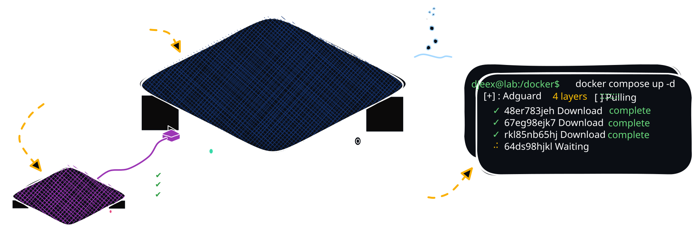

<p align="center">


[](https://docu.djeex.fr/)
[](https://docu.djeex.fr/)
</p>

# 🔧 Homelab docs & other dumb things

**Docu·djeex** is first and foremost a personal project aimed at self-hosting as many everyday services as possible, without relying on proprietary platforms (Google, Apple, Netflix, etc.).
This documentation site is built using [Nuxt.js](https://nuxt.com/), on the [Docus](https://docus.dev) theme (Nuxt UI + Nuxt Content).

This repository contains everything you need to edit pages, apply your changes, and redeploy the site. See [CUSTOMIZATIONS.md](CUSTOMIZATIONS.md) for everything added on top of the base Docus theme.

## Requirements

- Node.js 20 or later
- npm

## Getting started

Install dependencies:

```bash
npm install
```

Start the dev server:

```bash
npm run dev
```

The site will be available at `http://localhost:3000`.

## Build

```bash
npm run build
```

This builds the production site (pointed at `https://docu.djeex.fr` via `NUXT_SITE_URL`) into `.output`. Run it with:

```bash
node .output/server/index.mjs
```

## Project structure

```
content/
├── en/          # English content, served at /en/...
└── fr/          # French content, served at /fr/...

app/
├── components/  # Custom components and overrides of Docus's own components
└── pages/       # The catch-all docs page

content.config.ts   # Content collections and frontmatter schema
nuxt.config.ts       # Nuxt/Docus/i18n configuration
app/app.config.ts    # Theme, colors, branding
```

## Languages

- English (`en`) — default locale, served under `/en`
- French (`fr`) — served under `/fr`

Visiting `/` redirects to `/en` or `/fr` based on the visitor's browser language (or a previous choice, remembered via cookie).
